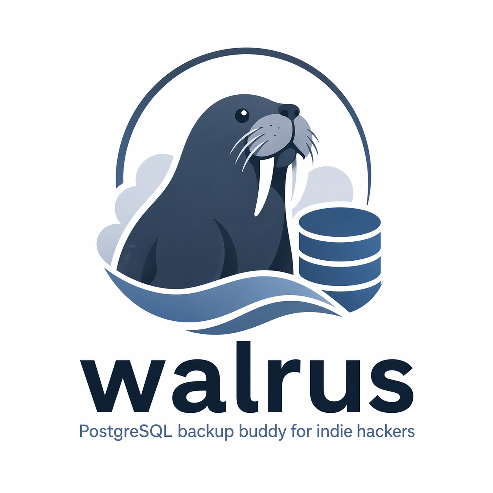

<p align="center">
  
</p>

<h1 align="center">walrus</h1>

<p align="center">
  <strong>L'outil de sauvegarde PostgreSQL pour les indie hackers</strong>
</p>

<p align="center">
  <a href="https://github.com/LayFz/walrus/releases"></a>
  <a href="https://github.com/LayFz/walrus/blob/main/LICENSE"></a>
  <a href="https://github.com/LayFz/walrus/stargazers"></a>
</p>

<p align="center">
  <a href="../README.md">English</a> |
  <a href="./README_CN.md">简体中文</a> |
  <a href="./README_TW.md">繁體中文</a> |
  <a href="./README_JA.md">日本語</a> |
  Français
</p>

---

Une seule commande pour sauvegarder toutes vos bases PostgreSQL sur Cloudflare R2. Concu pour les indie hackers — multi-projets, multi-serveurs, zero prise de tete.

## Fonctionnalites

- **Deux modes de deploiement** — Conteneur Docker / connexion directe (local ou distant), gestion unifiee
- **Configuration interactive** — Guide etape par etape, pas besoin de memoriser les options
- **Sauvegarde physique** — Utilise `pg_basebackup`, contourne le moteur de requetes, zero impact sur votre application
- **Synchronisation incrementale WAL** — Toutes les 5 minutes, ne transfere que les nouvelles donnees, perte maximale de 5 min
- **Limitation de bande passante** — 2 MB/s par defaut, n'affecte pas votre trafic de production
- **Multi-projets** — Differentes bases sur differents serveurs, tout organise dans un seul bucket R2
- **Nettoyage automatique** — Retention de 7 jours par defaut, nettoyage synchronise local et R2
- **Restauration en un clic** — Selection interactive des sauvegardes avec restauration point-in-time (PITR)
- **Integration systemd** — Fonctionne comme un service systeme, demarre au boot
- **Securite de concurrence** — Les fichiers de verrou empechent les sauvegardes en double

## Demarrage rapide

### Installation

```bash
# Installer la derniere version
curl -sSL https://raw.githubusercontent.com/LayFz/walrus/main/install.sh | sudo bash

# Installer une version specifique
curl -sSL https://raw.githubusercontent.com/LayFz/walrus/main/install.sh | WALRUS_VERSION=2.0.0 sudo -E bash
```

L'installateur configure automatiquement `postgresql-client` s'il n'est pas deja present.

### Mise a jour

```bash
# Mettre a jour vers la derniere version (meme commande que l'installation)
curl -sSL https://raw.githubusercontent.com/LayFz/walrus/main/install.sh | sudo bash
```

Les configurations de projets et les parametres rclone existants sont preserves lors de la mise a jour.

### Configuration

```bash
# 1. Configurer le stockage R2 (interactif)
walrus config

# 2. Enregistrer un projet (interactif)
walrus init

# 3. Verifier que tout fonctionne
walrus status
```

## Modes de deploiement

### Conteneur Docker

PostgreSQL tourne dans Docker. walrus se connecte via le port mappe.

```bash
walrus init --mode docker \
  --project myapp \
  --container postgres \
  --host localhost --port 5432 \
  --user myuser --db mydb
```

### Connexion directe

PostgreSQL est accessible via host:port — que ce soit en localhost, un serveur distant ou un service manage comme RDS.

```bash
walrus init --mode direct \
  --project myapp \
  --host 10.0.1.5 --port 5432 \
  --user myuser --db mydb
```

> En mode interactif, pas besoin de retenir les options — `walrus init` vous guide etape par etape.

## Commandes

| Commande | Description |
|----------|-------------|
| `walrus config` | Configurer le stockage distant (R2/S3/MinIO) |
| `walrus init` | Enregistrer un projet avec configuration interactive |
| `walrus backup` | Executer une sauvegarde physique complete |
| `walrus sync` | Synchroniser les journaux WAL vers R2 |
| `walrus restore` | Restaurer la base de donnees depuis R2 |
| `walrus status` | Afficher l'etat de tous les projets |
| `walrus list` | Afficher les details des sauvegardes R2 |
| `walrus logs` | Voir les logs (`-f` pour le suivi en direct) |
| `walrus service` | Gerer les services systemd |
| `walrus remove` | Supprimer un projet |
| `walrus update` | Mettre a jour walrus |

> Quand un seul projet est enregistre, `--project` peut etre omis. Alias : `st`=status, `ls`=list, `rm`=remove

## Restauration

```bash
# Restauration interactive
walrus restore

# Restaurer a un point dans le temps specifique
walrus restore --project myapp --password secret \
  --target-time "2026-04-23 14:30:00+08"
```

Toutes les restaurations demarrent un conteneur Docker local (port 15432) pour verification. Une fois confirme, vous pouvez migrer les donnees en production.

## Fonctionnement

```
Quotidien 03:00                          Toutes les 5 min
┌──────────────────┐                     ┌─────────────────┐
│  pg_basebackup   │                     │  Archivage WAL   │
│  (physique)      │                     │  (incrementiel)  │
└────────┬─────────┘                     └────────┬────────┘
         │                                        │
         │  --max-rate=30M                        │  nouveaux fichiers
         │  --checkpoint=spread                   │  --checksum
         ▼                                        ▼
┌──────────────────────────────────────────────────────┐
│               rclone (--bwlimit 2M)                  │
└─────────────────────────┬────────────────────────────┘
                          │
                          ▼
                 ┌─────────────────┐
                 │  Cloudflare R2  │
                 └─────────────────┘
```

## Prerequis

- Linux ou macOS
- Bash 4+
- PostgreSQL 12+ (outils client installes automatiquement)
- Cloudflare R2 / Amazon S3 / tout stockage compatible S3
- **Mode Docker** : Docker installe + conteneur PostgreSQL
- **Restauration** : Docker requis (tous les modes)
- Acces root recommande pour l'integration systemd

## Desinstallation

```bash
walrus service disable
crontab -l 2>/dev/null | grep -v "walrus:" | crontab -
rm -f /usr/local/bin/walrus
rm -rf /opt/walrus
rm -f /etc/systemd/system/walrus-*
systemctl daemon-reload
```

## Star History

<p align="center">
  <a href="https://star-history.com/#LayFz/walrus&Date">
    
  </a>
</p>

## Licence

[MIT](../LICENSE)
