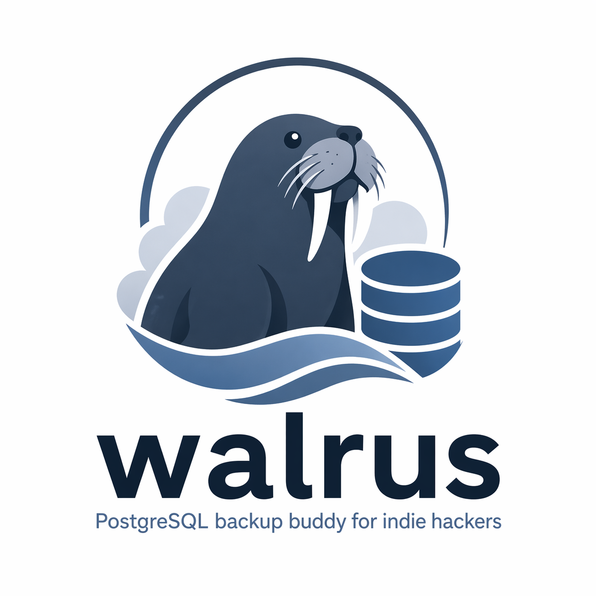

<p align="center">
  
</p>

<h1 align="center">walrus</h1>

<p align="center">
  <strong>L'outil de sauvegarde PostgreSQL pour les indie hackers</strong>
</p>

<p align="center">
  <a href="https://github.com/LayFz/walrus/releases"></a>
  <a href="https://github.com/LayFz/walrus/blob/main/LICENSE"></a>
  <a href="https://github.com/LayFz/walrus/stargazers"></a>
</p>

<p align="center">
  <a href="./README_CN.md">简体中文</a> |
  <a href="./README_TW.md">繁體中文</a> |
  <a href="../README.md">English</a> |
  <a href="./README_JA.md">日本語</a> |
  Francais
</p>

---

Une seule commande pour sauvegarder toutes vos bases PostgreSQL sur Cloudflare R2. Sauvegardez plusieurs serveurs au meme endroit, restaurez depuis n'importe ou — ne perdez plus jamais vos donnees.

## Pourquoi walrus ?

- **Sauvegarde multi-serveurs** — Gerez les sauvegardes de tous vos serveurs en un seul endroit, quel que soit le nombre de bases de donnees
- **Reprise apres sinistre** — Sauvegardes stockees sur le cloud distant (R2/S3), restauration sur n'importe quelle machine meme si le serveur d'origine est completement perdu
- **Restauration point-in-time** — L'archivage WAL permet de restaurer a n'importe quel moment des 7 derniers jours, pas seulement la derniere sauvegarde
- **Configurez et oubliez** — Configuration unique, puis tout est automatique : sauvegarde complete quotidienne + synchronisation WAL toutes les 5 minutes

## Fonctionnalites

- **Deux modes de deploiement** — Conteneur Docker / connexion directe (local ou distant), gestion unifiee
- **Configuration interactive** — Guide etape par etape, pas besoin de memoriser les options
- **Sauvegarde physique** — Utilise `pg_basebackup`, contourne le moteur de requetes, zero impact sur votre application
- **Synchronisation incrementale WAL** — Toutes les 5 minutes, ne transfere que les nouvelles donnees, perte maximale de 5 min
- **Limitation de bande passante** — 2 MB/s par defaut, n'affecte pas votre trafic de production
- **Multi-projets** — Differentes bases sur differents serveurs, tout organise dans un seul bucket R2
- **Nettoyage automatique** — Retention de 7 jours par defaut, nettoyage synchronise local et R2
- **Restauration en un clic** — Selection interactive des sauvegardes avec restauration point-in-time (PITR)
- **Mise a jour automatique** — `walrus update` pour mettre a jour, pas besoin de reinstaller
- **Securite de concurrence** — Les fichiers de verrou empechent les sauvegardes en double

## Etape 1 : Installation

```bash
# Installer la derniere version
curl -sSL https://raw.githubusercontent.com/LayFz/walrus/main/install.sh | sudo bash
```

L'installateur configure automatiquement `postgresql-client` et `rclone` s'ils ne sont pas deja presents.

## Etape 2 : Mise a jour (utilisateurs existants)

```bash
# Mise a jour automatique vers la derniere version
walrus update
```

Les configurations de projets et les parametres rclone existants sont preserves lors de la mise a jour.

## Etape 3 : Configurer le stockage distant

```bash
walrus config
```

Configuration interactive — choisissez votre fournisseur de stockage (Cloudflare R2, Amazon S3, MinIO, etc.), entrez vos identifiants, et walrus verifie automatiquement la connexion.

## Etape 4 : Enregistrer un projet et demarrer la sauvegarde

```bash
walrus init
```

`walrus init` vous guide a travers :
1. Selection du mode de deploiement (Docker / Connexion directe)
2. Saisie des identifiants de la base de donnees
3. Configuration de l'archivage WAL
4. Installation des timers systemd (sauvegarde complete quotidienne a 03:00, synchronisation WAL toutes les 5 min)
5. Execution d'un test de bout en bout

Apres `init`, les sauvegardes s'executent automatiquement. Aucune action supplementaire n'est necessaire.

### Modes de deploiement

**Docker** — PostgreSQL tourne dans un conteneur Docker. walrus execute `pg_basebackup` a l'interieur du conteneur, pas besoin d'exposer les ports.

```bash
walrus init --mode docker \
  --project myapp \
  --container postgres \
  --user myuser --db mydb
```

**Connexion directe** — PostgreSQL est accessible via host:port — que ce soit en localhost, un serveur distant ou un service manage comme RDS.

```bash
walrus init --mode direct \
  --project myapp \
  --host 10.0.1.5 --port 5432 \
  --user myuser --db mydb
```

> En mode interactif, pas besoin de retenir les options — `walrus init` vous guide etape par etape.

## Etape 5 : Surveillance et gestion

```bash
# Verifier l'etat des projets et la sante des services
walrus status

# Voir les sauvegardes sur R2
walrus list

# Voir les logs de sauvegarde et de synchronisation
walrus logs

# Suivre les logs en temps reel
walrus logs -f

# Gerer les services systemd
walrus service status
walrus service stop
walrus service start
```

### Services programmes

| Unite | Description | Frequence |
|-------|-------------|-----------|
| `walrus-sync@<project>.timer` | Synchronisation incrementale WAL | Toutes les 5 min |
| `walrus-backup@<project>.timer` | Sauvegarde physique complete + nettoyage | Quotidien 03:00 |

## Etape 6 : Restauration (depuis n'importe quelle machine)

La restauration fonctionne sur **n'importe quelle machine** avec walrus et Docker installes — meme un tout nouveau serveur. Vous avez seulement besoin de la **cle R2** : walrus lit les metadonnees du projet depuis R2 et la version PostgreSQL depuis la sauvegarde elle-meme, donc aucun fichier de configuration a copier et aucun `walrus init` a executer sur la machine de restauration.

```bash
# Sur la nouvelle machine : installer walrus et configurer la meme cle R2
curl -sSL https://raw.githubusercontent.com/LayFz/walrus/main/install.sh | sudo bash
walrus config

# Restauration interactive (choisir le projet, puis la sauvegarde)
walrus restore

# Ou cibler directement un projet / un point dans le temps
walrus restore --project myapp
walrus restore --project myapp --target-time "2026-04-23 14:30:00+08"
```

> Aucun mot de passe n'est requis — le cluster restaure conserve ses identifiants d'origine. Si la sauvegarde choisie ne contient aucune donnee, walrus vous avertit pour que vous puissiez en choisir une plus ancienne.

Processus de restauration :
1. Lit les metadonnees du projet depuis R2 (la version PostgreSQL vient de la sauvegarde), puis telecharge la sauvegarde complete + les fichiers WAL
2. Demarre un conteneur Docker temporaire (port 15432) avec la version PostgreSQL correspondante
3. Applique le rejeu WAL pour la restauration point-in-time
4. Vous verifiez les donnees : `docker exec -it walrus_myapp_restore psql -U <db_user> -d <db_name>`
5. Une fois confirme, migrez les donnees en production

## Commandes

| Commande | Description |
|----------|-------------|
| `walrus config` | Configurer le stockage distant (R2/S3/MinIO) |
| `walrus init` | Enregistrer un projet avec configuration interactive |
| `walrus backup` | Executer une sauvegarde physique complete |
| `walrus sync` | Synchroniser les journaux WAL vers R2 |
| `walrus restore` | Restaurer la base de donnees depuis R2 |
| `walrus status` | Afficher l'etat de tous les projets |
| `walrus list` | Afficher les details des sauvegardes R2 |
| `walrus logs` | Voir les logs (`-f` pour le suivi en direct) |
| `walrus service` | Gerer les services systemd |
| `walrus remove` | Supprimer un projet |
| `walrus update` | Mettre a jour walrus |
| `walrus help` | Afficher l'aide |

> Quand un seul projet est enregistre, `--project` peut etre omis. Alias : `st`=status, `ls`=list, `rm`=remove, `svc`=service

## Fonctionnement

```
Quotidien 03:00                          Toutes les 5 min
┌──────────────────┐                     ┌─────────────────┐
│  pg_basebackup   │                     │  Archivage WAL   │
│  (physique)      │                     │  (incrementiel)  │
└────────┬─────────┘                     └────────┬────────┘
         │                                        │
         │  --max-rate=30M                        │  nouveaux fichiers
         │  --checkpoint=spread                   │  --checksum
         ▼                                        ▼
┌──────────────────────────────────────────────────────┐
│               rclone (--bwlimit 2M)                  │
└─────────────────────────┬────────────────────────────┘
                          │
                          ▼
                 ┌─────────────────┐
                 │  Cloudflare R2  │
                 │  (S3 / MinIO)   │
                 └─────────────────┘
```

### Architecture multi-projets

```
Votre serveur (walrus)
├── walrus init --mode docker --project shop     # Docker PostgreSQL
├── walrus init --mode direct --project blog     # PostgreSQL local
├── walrus init --mode direct --project saas     # PostgreSQL distant
│
└── Toutes les sauvegardes -> Cloudflare R2
                     backup/
                     ├── shop/
                     │   ├── base/
                     │   └── wal/
                     ├── blog/
                     │   ├── base/
                     │   └── wal/
                     └── saas/
                         ├── base/
                         └── wal/
```

## Impact sur les performances

walrus est concu pour etre sur en production :

| Mesure | Details |
|--------|---------|
| `--checkpoint=spread` | Repartit les I/O de checkpoint, evite les pics |
| `--max-rate=30M` | Limite la vitesse de lecture disque |
| `--bwlimit 2M` | Limitation du debit d'upload, impact reseau negligeable |
| Archive WAL (`cp`) | Simple copie de fichier, overhead minimal |

Ces valeurs par defaut sont sures pour les bases sous charge intensive.

## Prerequis

- Linux ou macOS
- Bash 4+
- PostgreSQL 12+ (mode Docker : outils client non requis sur l'hote)
- Cloudflare R2 / Amazon S3 / tout stockage compatible S3
- **Mode Docker** : Docker installe + conteneur PostgreSQL
- **Restauration** : Docker requis (tous les modes)
- Acces root recommande pour l'integration systemd

## Desinstallation

```bash
walrus service disable
rm -f /usr/local/bin/walrus
rm -rf /opt/walrus
rm -f /etc/systemd/system/walrus-*
systemctl daemon-reload
```

## Star History

<p align="center">
  <a href="https://star-history.com/#LayFz/walrus&Date">
    
  </a>
</p>

## Licence

[MIT](../LICENSE)
